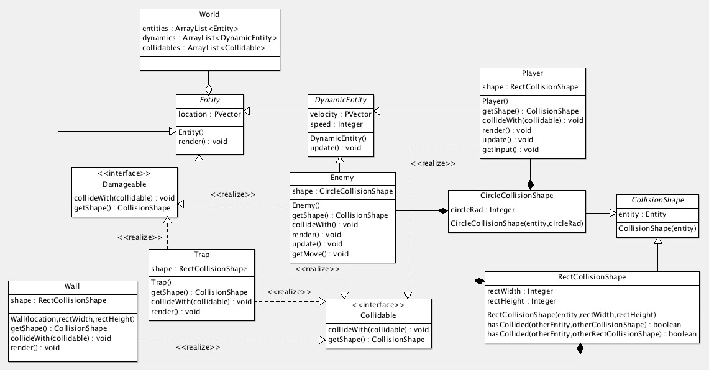

# Projeto Final - POO

O projeto consiste em um jogo escrito em Processing.
Os conhecimentos adiquiridos na cadeira de Programação Orientada a Objetos (POO) foram aplicados no projeto com isso, foi possível fixar os conhecimentos ensinados em sala de aula.

No diretório `uml/` existe o arquivo `trabalho-final.xmi.zargo`, desenvolvido para gerar o diagrama de classes.

## Diagrama de Classes - UML

