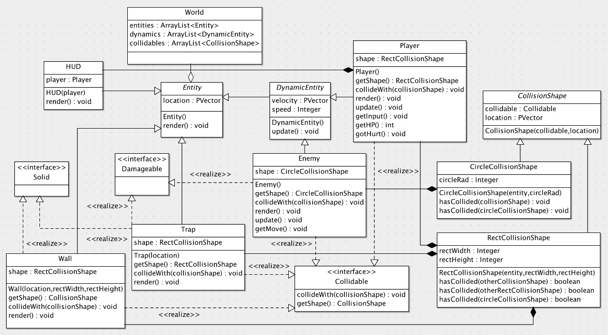

# Projeto Final - POO

# Equipe
Bianca Cruz
Rômulo Evangelista 
Ulisses Lopes
# O Projeto
O projeto consiste em um protótipo de jogo escrito em Processing.

### Como executar:

1- faça o download e instalação do Processing - Versão 4.1.1 [https://processing.org/download](https://processing.org/download);

2- descompacte o arquivo POOTrabalhoFinal.zip

3- abra o Processing e escolha a opção de abrir um projeto - `Arquivo` > `Abrir...` - e escolha algum arquivo do projeto;

4- com o projeto aberto, pode apertar no ícone de "Play" do Processing e o jogo irá abrir em uma nova janela.

Os conhecimentos adiquiridos na cadeira de Programação Orientada a Objetos (POO) foram aplicados no projeto, com isso, foi possível fixar os conhecimentos ensinados em sala de aula.

No diretório `uml/` existe o arquivo `trabalho-final.xmi.zargo` desenvolvido para gerar o diagrama de classes.

## Diagrama de Classes - UML

